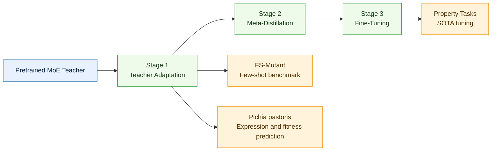

# 🧬 PROMEX: expert-routed meta-learning enables cumulative protein engineering from small data


PROMEX (Protein Meta-MoE Evolution and eXploration) is an expert-routed meta-learning framework for data-efficient protein engineering. This repository contains the code and prepared artifacts used for the PROMEX article code release.

> [!NOTE]
> This package is organized for artifact review: start with the quick artifact check, then use the `run.sh` file inside each task folder for full training or prediction commands.

## 🔎 Overview

PROMEX uses a three-stage workflow:

1. **Teacher adaptation** (`2_Property/1_Teacher`): adapt the pretrained MoE teacher on three protein tasks so it first learns general protein-task information.
2. **Meta-distillation** (`2_Property/2_MetaDistill`): for each downstream task, initialize from a teacher-adapt checkpoint trained on a different task, then distill it into a student model for fast adaptation.
3. **Fine-tuning** (`2_Property/3_Finetune`): continue from the MetaDistill student checkpoint of the same downstream task and fine-tune it to obtain the best final performance.

The prospective *Pichia pastoris* secretion-expression prediction workflow is provided separately in `4_Pichia_Pastoris`.

## 🚀 Quick Navigation

| Need | Go to |
| --- | --- |
| Install and check required files | [`COMPUTE.md`](COMPUTE.md) |
| Understand model artifacts and intended use | [`MODEL_CARD.md`](MODEL_CARD.md) |
| Download all task model weights | [Google Drive weights folder](https://drive.google.com/drive/folders/13M4PvkqWQg_03aXeX7IobyM-paN9Y-wg?usp=sharing) |
| Reproduce property experiments | `2_Property/*/run.sh` |
| Reproduce FS-Mutant benchmark | `3_FsMutant/run.sh` |
| Reproduce Pichia workflows | `4_Pichia_Pastoris/*/run.sh` |

## 🧭 Workflow Map



The code supports five LMDB task folders:

| Dataset | Main use | Task type |
| --- | --- | --- |
| `Stability` | teacher / MetaDistill / fine-tune | regression |
| `Thermostability` | MetaDistill / fine-tune | regression |
| `Beta-Lactamase` | teacher / MetaDistill / fine-tune | regression |
| `Remote-Homology` | MetaDistill / fine-tune | classification, 1195 labels |
| `Secondary-Structure` | teacher adaptation | token classification, 3 labels |

> [!TIP]
> Few-shot splits are organized as `percent1`, `percent5`, `percent10`, and `percent30`, with `random1` to `random3` repeats. Full-data runs use `normal`.

## 📁 Repository Layout

```text
PROMEX/
├── 1_Data/LMDB/                         # Prepared LMDB datasets
├── 2_Property/
│   ├── 1_Teacher/                       # Adapt MoE teacher on protein tasks
│   ├── 2_MetaDistill/                   # Target-adaptive meta-distillation
│   └── 3_Finetune/                      # Downstream fine-tuning and testing
├── 3_FsMutant/                          # FS-Mutant few-shot mutation benchmark
├── 4_Pichia_Pastoris/                   # Pichia pastoris wet-lab prediction workflow
│   ├── 1_Teacher/                       # Adapt the MoE teacher on MPB-EXP
│   ├── 2_MetaDistill_Expression/        # Expression MetaDistill for three rounds
│   ├── 3_Finetune_Expression/           # Expression fine-tuning
│   └── 4_Fitness_Prediction/            # Few-shot mutation fitness/ranking prediction
├── weights/
│   ├── esm2_t33_650M_UR50D/             # ESM-2 650M backbone files
│   └── pretrained/moe_teacher_pretrained_model.pt
├── demo_data/property_regression_demo.csv       # Real-sample CSV-to-LMDB template
├── demo_smoke_test.py                         # Legacy smoke-test helper
├── tools/csv_to_lmdb.py
├── environment.yml
├── COMPUTE.md
├── MODEL_CARD.md
└── LICENSE
```

Large files in this package include the ESM-2 weights and the pretrained PROMEX teacher checkpoint. The current pretrained teacher checkpoint is expected at:

```text
weights/pretrained/moe_teacher_pretrained_model.pt
```

> [!NOTE]
> All task-related model weights are available from the [PROMEX Google Drive weights folder](https://drive.google.com/drive/folders/13M4PvkqWQg_03aXeX7IobyM-paN9Y-wg?usp=sharing).

## ⚙️ Environment

Create the environment from `environment.yml`:

```bash
cd /path/to/PROMEX
conda env create -f environment.yml
conda activate promex
```

If you use the provided local environment instead:

```bash
source venv/bin/activate
```

Run all property-stage commands from the corresponding stage directory, because config paths are relative to that directory.

### ✅ Quick Artifact Check

```bash
bash -lc '
set -e
echo "[1/6] Checking 2_Property LMDB data"
test -d 1_Data/LMDB/Stability/normal/train
echo "      found: 1_Data/LMDB/Stability/normal/train"

echo "[2/6] Checking FS-Mutant structure table"
test -f 3_FsMutant/data/struc_sq_72.csv
echo "      found: 3_FsMutant/data/struc_sq_72.csv"

echo "[3/6] Checking FS-Mutant preprocessed task bundle"
test -f 3_FsMutant/data/merged.pkl
echo "      found: 3_FsMutant/data/merged.pkl"

echo "[4/6] Checking Pichia expression LMDB data"
test -d 1_Data/LMDB/Pichia-Pastoris/cls2/train_cv3/fold3/train
echo "      found: 1_Data/LMDB/Pichia-Pastoris/cls2/train_cv3/fold3/train"

echo "[5/6] Checking pretrained PROMEX teacher checkpoint"
test -f weights/pretrained/moe_teacher_pretrained_model.pt
echo "      found: weights/pretrained/moe_teacher_pretrained_model.pt"

echo "[6/6] Checking Pichia mutation CSV"
test -f 4_Pichia_Pastoris/4_Fitness_Prediction/data/Pichia-Pastoris/substitutions_round1/single_mutant/DeltaE/Pel114_pectate_lyase.csv
echo "      found: 4_Pichia_Pastoris/4_Fitness_Prediction/data/Pichia-Pastoris/substitutions_round1/single_mutant/DeltaE/Pel114_pectate_lyase.csv"

echo "PROMEX demo files OK"
'
```

This checks representative real property data, real FS-Mutant files, Pichia expression data, the pretrained teacher checkpoint, and a Pichia mutation CSV. It does not train a model and should finish immediately. Full training and prediction commands are listed in the `run.sh` file under each task directory.

## 🧾 Compute and Reproducibility

For editor and reviewer checks, see [`COMPUTE.md`](COMPUTE.md). It records the required reproducibility checklist, fixed environment file, tested OS/GPU, estimated installation time, a one-command artifact check, expected output, demo runtime, custom data formats, CSV-to-LMDB conversion command, Pichia mutation-file format, and license information. For model and checkpoint details, see [`MODEL_CARD.md`](MODEL_CARD.md). All required items are checked there; only full reproduction of all experiments is marked optional because it is computationally expensive.

## 🧑‍🏫 Stage 1: Teacher Adaptation

Teacher adaptation starts from `weights/pretrained/moe_teacher_pretrained_model.pt`. In this stage, only three source protein tasks are used: Stability, Beta-Lactamase, and Secondary-Structure. The goal is to let the MoE teacher learn useful protein-task information before it is transferred to other downstream tasks.

> [!IMPORTANT]
> The teacher-adapt checkpoints used in the following stages have already been prepared in this release. You only need to rerun this stage if you want to regenerate them.

Optional regeneration commands:

```bash
cd 2_Property/1_Teacher

CUDA_VISIBLE_DEVICES=2 python scripts/training.py -c config/Beta-Lactamase/adapt-normal.yaml
CUDA_VISIBLE_DEVICES=2 python scripts/training.py -c config/Secondary-Structure/adapt-normal.yaml
CUDA_VISIBLE_DEVICES=2 python scripts/training.py -c config/Stability/adapt-normal.yaml
```

Prepared checkpoint paths:

```text
2_Property/1_Teacher/weights/Stability-adapt/esm2_t33_650M_UR50D.pt
2_Property/1_Teacher/weights/Beta-Lactamase-adapt/esm2_t33_650M_UR50D.pt
2_Property/1_Teacher/weights/Secondary-Structure-adapt/esm2_t33_650M_UR50D.pt
```

The YAML files expect these checkpoints under `2_Property/1_Teacher/weights/`.

## 🔁 Stage 2: Meta-Distillation

MetaDistill is run on each downstream task. For both full-data (`normal`) and few-shot (`percent1`, `percent5`, `percent10`, `percent30`) experiments, the model is initialized with a teacher-adapt checkpoint from a different task. This cross-task initialization is set by `teacher_checkpoint` in each YAML file. The output is a MetaDistill student checkpoint for the current downstream task.

Stage 1 checkpoints used by MetaDistill:

| Downstream task | Splits | Stage 1 source task used for initialization | Checkpoint |
| --- | --- | --- | --- |
| `Stability` | `normal`, `percent1`, `percent5`, `percent10`, `percent30` | `Beta-Lactamase` | `2_Property/1_Teacher/weights/Beta-Lactamase-adapt/esm2_t33_650M_UR50D.pt` |
| `Thermostability` | `normal`, `percent1`, `percent5`, `percent10`, `percent30` | `Stability` | `2_Property/1_Teacher/weights/Stability-adapt/esm2_t33_650M_UR50D.pt` |
| `Beta-Lactamase` | `normal`, `percent1`, `percent5`, `percent10`, `percent30` | `Stability` | `2_Property/1_Teacher/weights/Stability-adapt/esm2_t33_650M_UR50D.pt` |
| `Remote-Homology` | `normal`, `percent1`, `percent5`, `percent10`, `percent30` | `Secondary-Structure` | `2_Property/1_Teacher/weights/Secondary-Structure-adapt/esm2_t33_650M_UR50D.pt` |

```bash
cd 2_Property/2_MetaDistill

CUDA_VISIBLE_DEVICES=1 python scripts/training.py -c config/Remote-Homology/promex-normal.yaml
CUDA_VISIBLE_DEVICES=2 python scripts/training.py -c config/Thermostability/promex-normal.yaml
CUDA_VISIBLE_DEVICES=2 python scripts/training.py -c config/Stability/promex-normal.yaml
CUDA_VISIBLE_DEVICES=2 python scripts/training.py -c config/Beta-Lactamase/promex-normal.yaml
```

For few-shot settings, replace `promex-normal.yaml` with files such as:

```text
config/Beta-Lactamase/promex-percent1.yaml
config/Remote-Homology/promex-percent5.yaml
config/Thermostability/promex-percent10.yaml
config/Stability/promex-precent30.yaml
```

Note: the Stability MetaDistill config filenames use `precent` in this snapshot.

## 🎯 Stage 3: Fine-Tuning

Fine-tuning uses the MetaDistill student checkpoint from the same downstream task as initialization. This checkpoint is set by `from_checkpoint` in each YAML file. The model is then quickly fine-tuned on the target task to reach the final reported performance.

```bash
cd 2_Property/3_Finetune

CUDA_VISIBLE_DEVICES=2 python scripts/training.py -c config/Remote-Homology/promex-normal.yaml
CUDA_VISIBLE_DEVICES=3 python scripts/training.py -c config/Thermostability/promex-normal.yaml
CUDA_VISIBLE_DEVICES=4 python scripts/training.py -c config/Stability/promex-normal.yaml
CUDA_VISIBLE_DEVICES=2 python scripts/training.py -c config/Beta-Lactamase/promex-normal.yaml
```

Few-shot examples:

```bash
CUDA_VISIBLE_DEVICES=0 python scripts/training.py -c config/Stability/promex-percent1.yaml
CUDA_VISIBLE_DEVICES=0 python scripts/training.py -c config/Beta-Lactamase/promex-percent5.yaml
CUDA_VISIBLE_DEVICES=0 python scripts/training.py -c config/Remote-Homology/promex-percent10.yaml
```

To compare with plain ESM-2 fine-tuning, comment out `from_checkpoint` in the fine-tuning YAML.

## 🧪 Reproduce One Example

The following example reproduces the Stability workflow starting from the prepared Stage 1 teacher-adapt checkpoint. It uses the Beta-Lactamase adapted teacher to initialize Stability MetaDistill, then fine-tunes the Stability student checkpoint.

```bash
# 1. Meta-distill on the downstream Stability task.
cd 2_Property/2_MetaDistill
CUDA_VISIBLE_DEVICES=2 python scripts/training.py -c config/Stability/promex-normal.yaml

# 2. Fine-tune/evaluate on the same downstream Stability task.
cd ../3_Finetune
CUDA_VISIBLE_DEVICES=4 python scripts/training.py -c config/Stability/promex-normal.yaml
```

Required prepared checkpoint:

```text
2_Property/1_Teacher/weights/Beta-Lactamase-adapt/esm2_t33_650M_UR50D.pt
```

Expected new checkpoints:

```text
2_Property/2_MetaDistill/weights/Stability/normal/esm2_t33_650M_UR50D.pt
2_Property/3_Finetune/weights/Stability/normal/promex/esm2_t33_650M_UR50D.pt
```

## 📊 FS-Mutant Benchmark

`3_FsMutant` contains the few-shot mutation benchmark pipeline.

FS-Mutant also reuses a prepared Stage 1 teacher-adapt checkpoint:

| Benchmark | Stage 1 source task used for initialization | Default checkpoint | How to change it |
| --- | --- | --- | --- |
| `FS-Mutant` | `Secondary-Structure` | `2_Property/1_Teacher/weights/Secondary-Structure-adapt/esm2_t33_650M_UR50D.pt` | pass `-tckpt /path/to/checkpoint.pt` to `main.py` |

```bash
cd 3_FsMutant

python preprocess.py
python retrieve.py -m vectorize -md esm2 -b 8
python retrieve.py -m retrieve -md esm2 -b 16 -k 10 -mt cosine -cpu

TORCH_FORCE_NO_WEIGHTS_ONLY_LOAD=1 CUDA_VISIBLE_DEVICES=3 python main.py -md esm2 -m meta -ts 20 -tb 1 -r 16 -ls 5 -mi 5 -mtb 16 -meb 64 -alr 5e-3 -as 5 -e 100 -cv 5 -mt 3 -p all
TORCH_FORCE_NO_WEIGHTS_ONLY_LOAD=1 CUDA_VISIBLE_DEVICES=3 python main.py -md esm2 -m meta-transfer -ts 20 -tb 16 -r 16 -ls 5 -mi 5 -mtb 16 -meb 64 -alr 5e-3 -as 5 -e 100 -cv 5 -mt 3 -p all
TORCH_FORCE_NO_WEIGHTS_ONLY_LOAD=1 CUDA_VISIBLE_DEVICES=3 python main.py -md esm2 -m meta-transfer -ts 20 -tb 16 -r 16 -ls 5 -mi 5 -mtb 16 -meb 64 -alr 5e-3 -as 5 -e 100 -cv 5 -mt 3 -p all -t

python summarize_results.py
```

Change `-ts` to `40`, `80`, `160`, or `320` for other training sizes.

## 🧫 Pichia Pastoris Prediction

`4_Pichia_Pastoris` contains the wet-lab prediction code for *Pichia pastoris* secretion-expression engineering. The commands below are copied from the current `run.sh` files under each subfolder.

| Subfolder | Purpose |
| --- | --- |
| `1_Teacher` | Adapt the MoE teacher on the MPB-EXP binary expression task |
| `2_MetaDistill_Expression` | Binary secretion-expression MetaDistill for rounds 1-3 |
| `3_Finetune_Expression` | Expression fine-tuning with PROMEX-initialized and supervised ESM-2 configs |
| `4_Fitness_Prediction` | Few-shot mutation fitness/ranking prediction for wet-lab candidate selection |

Pichia teacher adaptation:

```bash
cd 4_Pichia_Pastoris/1_Teacher
CUDA_VISIBLE_DEVICES=2 python scripts/training.py -c config/MPB-EXP/adapt-normal.yaml
```

Expression MetaDistill:

```bash
cd 4_Pichia_Pastoris/2_MetaDistill_Expression
CUDA_VISIBLE_DEVICES=3 python scripts/training.py -c config/promex-binary-cv-round1.yaml
CUDA_VISIBLE_DEVICES=3 python scripts/training.py -c config/promex-binary-cv-round2.yaml
CUDA_VISIBLE_DEVICES=3 python scripts/training.py -c config/promex-binary-cv-round3.yaml
```

This expression workflow expects prepared Pichia expression LMDB data under `1_Data/LMDB/Pichia-Pastoris/cls2/`. The MetaDistill configs initialize from:

```text
4_Pichia_Pastoris/1_Teacher/weights/MPB-EXP-adapt/esm2_t33_650M_UR50D.pt
```

Expression fine-tuning:

```bash
cd 4_Pichia_Pastoris/3_Finetune_Expression
CUDA_VISIBLE_DEVICES=2 python scripts/training.py -c config/promex/promex-binary-cv-round1.yaml
CUDA_VISIBLE_DEVICES=2 python scripts/training.py -c config/supervised/esm2-binary-cv-round1.yaml
CUDA_VISIBLE_DEVICES=2 python scripts/training.py -c config/promex/promex-binary-cv-round2.yaml
CUDA_VISIBLE_DEVICES=2 python scripts/training.py -c config/supervised/esm2-binary-cv-round2.yaml
CUDA_VISIBLE_DEVICES=2 python scripts/training.py -c config/promex/promex-binary-cv-round3.yaml
CUDA_VISIBLE_DEVICES=2 python scripts/training.py -c config/supervised/esm2-binary-cv-round3.yaml
```

The `promex` fine-tuning configs continue from the expression MetaDistill checkpoint of the same round, while `supervised` configs fine-tune directly from ESM-2.

A typical fitness/ranking prediction run is:

```bash
cd 4_Pichia_Pastoris/4_Fitness_Prediction

python preprocess.py
CUDA_VISIBLE_DEVICES=2 python retrieve.py -m vectorize -md esm2 -b 8
python retrieve.py -m retrieve -md esm2 -b 16 -k 10 -mt cosine -cpu

TORCH_FORCE_NO_WEIGHTS_ONLY_LOAD=1 CUDA_VISIBLE_DEVICES=2 python main.py -md promex -m meta -ts 0 -tb 1 -r 16 -ls 3 -mi 5 -mt 4 -mtb 16 -meb 64 -alr 5e-3 -as 5 -e 100 -cv 5 -p all
TORCH_FORCE_NO_WEIGHTS_ONLY_LOAD=1 CUDA_VISIBLE_DEVICES=2 python main.py -md promex -m meta-transfer -ts 0 -tb 16 -r 16 -ls 3 -mi 5 -mt 4 -mtb 16 -meb 64 -alr 5e-3 -as 5 -e 100 -cv 5 -p all
TORCH_FORCE_NO_WEIGHTS_ONLY_LOAD=1 CUDA_VISIBLE_DEVICES=2 python main.py -md promex -m meta-transfer -ts 0 -tb 16 -r 16 -ls 3 -mi 5 -mt 4 -mtb 16 -meb 64 -alr 5e-3 -as 5 -e 100 -cv 5 -p all -t
```

Round-specific configs are provided under `4_Pichia_Pastoris/4_Fitness_Prediction/src/config_round*.json`. The active config is selected in `4_Pichia_Pastoris/4_Fitness_Prediction/src/__init__.py`. In the current snapshot it loads `config_round1_single_mutant.json`; change that import target only if you want to switch rounds. Use `-k 10` for round 1 retrieval and `-k 2` for round 2, as noted in the local `run.sh`. Predictions and wet-lab candidate tables are stored under `4_Pichia_Pastoris/4_Fitness_Prediction/data/predictions/`.

## 🏆 Key Reported Results

In the PROMEX study, the method was evaluated on Remote Homology, Thermostability, Stability, Beta-Lactamase, and FS-Mutant few-shot mutation tasks. The article reports strong few-shot generalization, including improvements over standard fine-tuning baselines and the 100B-parameter xTrimoProtein 1.5 in low-data regimes.

The experimental secretion-expression study used 111 heterologous proteins, with 87 proteins for the initial binary expression predictor and 24 proteins prospectively validated over three dry-wet rounds. PROMEX achieved an initial zero-shot hit rate of about 87% and identified multi-site variants with 4.8-fold and 4.4-fold expression increases.

## 📝 Notes

- `config_path` points to `weights/esm2_t33_650M_UR50D`.
- `teacher_checkpoint` controls which adapted teacher is used in MetaDistill.
- `from_checkpoint` controls which MetaDistill student checkpoint is used for final fine-tuning.
- Outputs and metrics are saved under each stage's `weights/` directory.
- The included `venv/` is convenient locally, but a Zenodo release usually only needs `environment.yml`, code, configs, prepared data, and required checkpoints.

## 📄 License

This code is released under the MIT License. See `LICENSE` for details.
